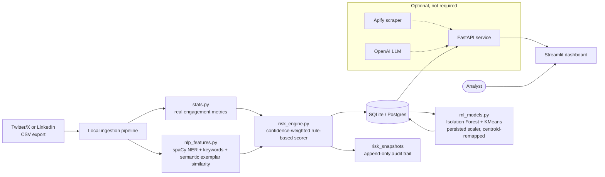

<div align="center">

# OSINT-Guard

**Turn a public Twitter/X or LinkedIn footprint into an explainable exposure-risk score — fully local, no LLM required.**

Ingest a Twitter/X or LinkedIn export, run it through a deterministic rule-based
risk engine plus local NLP (spaCy NER) and unsupervised ML (Isolation Forest,
KMeans), and get back an itemized 0-100 exposure risk score, extracted PII signals,
anomaly flags, and behavioral clusters — all visualized in an interactive
dashboard. Every point in every score is traceable to a specific, auditable
signal — not a black-box LLM guess.

[](https://www.python.org/)
[](https://fastapi.tiangolo.com/)
[](https://streamlit.io/)
[](https://scikit-learn.org/)
[](https://spacy.io/)
[](https://www.sqlalchemy.org/)

</div>

---

## Overview

Security teams and OSINT analysts routinely need to answer one question about a
target: *how much can an attacker infer about this person from what they've
already made public?* OSINT-Guard automates that assessment end-to-end — ingest,
engineer features, score, detect anomalies, cluster, and visualize — across two
independent public-data sources at once.

The core intelligence pipeline is **100% local**: a weighted rule-based scoring
engine, spaCy named-entity recognition, and scikit-learn's Isolation Forest /
KMeans all run on-device with no external API calls, no API key, and no cost.
An optional OpenAI + Apify path (live scraping and LLM-generated summaries)
still exists for users who want to add those keys later, but nothing in the
core pipeline depends on it.

> **Intended use:** authorized security research, red-team reconnaissance
> exercises, and OSINT-awareness training. Only assess accounts you're
> authorized to assess.

## Key Features

- 🧮 **Explainable risk engine** — a transparent, weighted scoring system (PII
  exposure, behavioral predictability, content/status sensitivity, exposure
  reach) with every point itemized and traceable to a real signal.
- 🎯 **Confidence-weighted, not just averaged** — both platforms dampen their
  predictability component by how much real data actually backs it (tweet
  count on Twitter, populated career fields on LinkedIn), so a single data
  point can never masquerade as a proven behavioral pattern.
- 🕵️ **Local NLP extraction** — spaCy NER pulls real locations, organizations,
  and PII-adjacent entities out of tweet text, bios, and LinkedIn headlines;
  a local sentence-embedding model (`all-MiniLM-L6-v2`) separately catches
  near-term/specific disclosures a keyword list can't — e.g. "flying home
  tomorrow" vs. "visited my parents last year." No LLM call involved either way.
- 🚨 **Unsupervised anomaly & persona detection** — Isolation Forest flags
  statistically anomalous accounts; KMeans clusters profiles into behavioral
  personas. Cluster identity is preserved across refits (a persisted scaler
  plus centroid remapping), so a persona's ID doesn't drift just because the
  model was refit — see `ml_models.py`.
- 🕰️ **Real audit trail, not a synthetic timeline** — every scoring event is
  appended to `risk_snapshots`, so re-ingesting after a methodology change
  produces genuine before/after history instead of a fabricated backfill.
- 🌐 **Two independent OSINT sources, one platform** — Twitter/X (engagement,
  posting patterns, tweet content) and LinkedIn (disclosed location, employer
  history, job-seeking status) share one scoring architecture via pluggable
  feature extractors.
- 🧹 **Data-quality visibility** — every ingestion reports rows skipped,
  malformed JSON fields, and missing dates, instead of silently zeroing them out.
- 📊 **Interactive, purposeful analytics** — every chart reflects a real
  computed signal (risk distribution, anomaly scores, cluster sizes, top
  disclosed locations) instead of a static placeholder.
- 🔓 **Optional AI path, not required** — live Apify scraping + OpenAI-generated
  summaries are still available behind an explicit "Advanced" toggle for users
  who add those API keys later.

## Architecture



The frontend never talks to the database or any external service directly —
every call is proxied through the FastAPI service, which is the single source
of truth for stored profiles and the only component holding credentials.

## Tech Stack

| Layer | Technology | Role |
| --- | --- | --- |
| UI | **Streamlit** + **Plotly** | Interactive dashboard — lookup, ingestion, analytics, model insights, profile browser. Native widgets only (`st.metric` with sparklines, bordered containers, `column_config` progress columns, Material icons); no HTML/CSS/JS is authored anywhere |
| API | **FastAPI** + **Uvicorn** | Async REST API, request validation, routing |
| Local NLP | **spaCy** (`en_core_web_sm`) | Named-entity recognition for PII/location extraction — no external calls |
| Semantic content scoring | **sentence-transformers** (`all-MiniLM-L6-v2`) | CPU-only exemplar-similarity scoring — catches near-term disclosures a keyword list can't, no training loop, no labeled dataset |
| Unsupervised ML | **scikit-learn** (Isolation Forest, KMeans) | Anomaly detection + behavioral clustering; `scipy` (optimal assignment) matches new cluster centroids back to the previous run's so persona identity survives a refit |
| Model persistence | **joblib** | Persists the fitted `StandardScaler` and cluster centroids under `backend/models/` (gitignored, regenerated on ingestion) |
| Risk scoring | Custom weighted engine (`risk_engine.py`) | Deterministic, itemized 0-100 score, confidence-weighted by data volume — no training data needed |
| Data wrangling | **pandas**, **numpy** | Feature engineering across both platforms |
| Validation & config | **Pydantic v2**, `pydantic-settings` | Typed request models, `.env`-driven settings, environment-forced production safety |
| Persistence | **SQLAlchemy 2.0** | ORM over SQLite (default) or any SQL database via `DATABASE_URL`; includes an append-only `risk_snapshots` audit table |
| Testing | **pytest** | Unit tests for the risk engine, NLP extractors, and ML layer; FastAPI `TestClient` route tests against an isolated temp DB |
| *Optional* | **OpenAI API**, **Apify** client | Live scraping + LLM-generated summaries, behind an explicit opt-in — not required |

## Project Structure

```text
osint-guard/
├── backend/                        FastAPI service
│   ├── app/
│   │   ├── main.py                 App factory, CORS, startup table creation
│   │   ├── config.py               Settings loaded from .env
│   │   ├── database.py             SQLAlchemy engine / session / declarative base
│   │   ├── models.py               TwitterProfile + LinkedInProfile + RiskSnapshot ORM models
│   │   ├── schemas.py              Pydantic request models
│   │   ├── routes.py               All /api/* endpoints
│   │   └── services/
│   │       ├── risk_engine.py      Platform-agnostic, confidence-weighted risk-scoring core
│   │       ├── nlp_features.py     spaCy NER + keywords + sentence-embedding exemplar similarity
│   │       ├── ml_models.py        Isolation Forest + KMeans, persisted scaler + centroid remapping
│   │       ├── local_ingest.py     CSV -> features -> score -> persist + snapshot, no API key
│   │       ├── stats.py            Deterministic tweet-engagement metrics
│   │       ├── analytics.py        Seaborn/matplotlib chart export (PNG)
│   │       ├── apify_collect.py    Optional: Apify actor runs → normalized tweets
│   │       └── openai_insights.py  Optional: chained OpenAI calls → LLM risk bundle
│   ├── models/                     Persisted scaler/centroid artifacts (gitignored, regenerated)
│   ├── tests/                      pytest suite (risk engine, NLP, ML layer, routes)
│   ├── requirements.txt
│   └── .env.example
│
└── frontend/                       Streamlit UI
    ├── streamlit_app.py            Target Lookup · Bulk Ingestion · Analytics · Model Insights · Database
    ├── .streamlit/config.toml      Native theme config (no custom HTML/CSS)
    └── requirements.txt
```

## Getting Started

### Prerequisites

- Python 3.11+
- No API keys required for the core pipeline.
- *(Optional)* An [Apify](https://apify.com/) API token + [OpenAI](https://platform.openai.com/) API key, only if you want the live-scrape/LLM-summary path.

### 1. Backend

```bash
cd backend
pip install -r requirements.txt
python -m spacy download en_core_web_sm   # one-time local NLP model download
cp .env.example .env                      # optional: only needed for the Apify/OpenAI path
uvicorn app.main:app --reload             # http://127.0.0.1:8000
```

Database tables are created automatically on first run. Interactive API docs
are served at `/docs` (Swagger) and `/redoc`. The semantic-scoring model
(`all-MiniLM-L6-v2`, ~90MB) downloads automatically from Hugging Face the
first time `/api/ingest-local/` runs — no separate command needed, but that
first ingestion needs internet access; every run after that is fully offline.

### 2. Frontend

```bash
cd frontend
pip install -r requirements.txt
streamlit run streamlit_app.py  # http://localhost:8501
```

### 3. Ingest a dataset

In the **Bulk Ingestion** tab, pick a platform (Twitter/X or LinkedIn), upload
a CSV export, and click **"Ingest locally (no AI, no API key)"**. Then use
**Model Insights → Recompute anomaly/cluster models** to fit Isolation Forest
and KMeans across the newly ingested profiles.

> The Apify/OpenAI path is entirely optional — everything else (ingestion,
> scoring, NER, anomaly detection, clustering, analytics) works with zero API
> keys configured.

## Environment Variables

Configured in `backend/.env` (see `backend/.env.example`) — **only relevant if
you're using the optional live-scrape/LLM path**; the local pipeline needs none of these:

| Variable | Default | Description |
| --- | --- | --- |
| `ENVIRONMENT` | `development` | Set to `production` to **force** `DEBUG=false` regardless of the `DEBUG` value below, so permissive CORS/tracebacks can't ship to a real deployment by accident |
| `DEBUG` | `true` | Enables permissive CORS and detailed error tracebacks for local dev; set `false` in production |
| `CORS_ALLOWED_ORIGINS` | `["http://localhost:8501", ...]` | Browser origins allowed to call the API when `DEBUG=false` |
| `DATABASE_URL` | SQLite file in `backend/` | Any SQLAlchemy-compatible connection string (Postgres, MySQL, etc.) |
| `APIFY_API_TOKEN` | *(empty)* | Optional — required only for live Twitter/X scraping |
| `APIFY_ACTOR_TWITTER` | `dy7gIgPRMhrOrfW0f` | Apify actor ID used for Twitter/X collection |
| `OPENAI_API_KEY` | *(empty)* | Optional — required only for the LLM-generated risk bundle |
| `OPENAI_MODEL` | `gpt-4o-mini` | Chat Completions model used for the optional AI path |
| `OPENAI_REQUEST_TIMEOUT` | `30` | Per-request timeout, in seconds |
| `AI_CACHE_TTL_HOURS` | `24` | How long a generated AI bundle is cached before re-analysis |

## API Reference

| Method | Endpoint | Description |
| --- | --- | --- |
| `GET` | `/api/health/` | Liveness probe |
| `POST` | `/api/ingest-local/` | **Primary path.** CSV -> local risk engine, per platform (`twitter` \| `linkedin`), no API key |
| `POST` | `/api/recompute-models/` | Refit Isolation Forest + KMeans for a platform. Cluster IDs are matched back to the previous run's by default; pass `force_retrain=true` to reset that |
| `GET` | `/api/profiles-summary/` | Uncapped, lightweight profile list for client-side charting |
| `GET` | `/api/analytics/` | Render static PNG charts (matplotlib/seaborn export) |
| `GET` | `/api/check-db/` | Fetch the 50 most recently scanned profiles |
| `GET` | `/api/profile-detail/{platform}/{identifier}/` | Full itemized risk-factor breakdown for one profile |
| `GET` | `/api/snapshots/{platform}/{identifier}/` | Every past scoring event for one profile, oldest first — the real (non-synthetic) audit trail |
| `GET` | `/api/usernames/` | List every stored handle/identifier for a platform |
| `GET / POST / DELETE` | `/api/clear-db/` | Wipe stored profiles for a platform |
| `POST` | `/api/collect/` | *Optional.* Scrape a handle's public tweets via Apify |
| `POST` | `/api/insights/` | *Optional.* Run the OpenAI risk bundle, DB-cached |
| `POST` | `/api/upload-bulk/` | *Optional.* CSV/JSON ingestion scored via chained OpenAI calls |
| `GET` | `/api/profile/{username}/` | Legacy Twitter-only quick lookup |

Full request/response schemas: `http://127.0.0.1:8000/docs`

## Usage

A persistent KPI header (population, mean exposure with a distribution
sparkline, high/critical count, anomaly flags) sits above five tabs. The
sidebar platform switcher (Twitter/X vs. LinkedIn) scopes every tab:

1. **Target Lookup** — look up an ingested profile and see its itemized
   exposure breakdown: points-per-bucket chart, a signal table with inline
   progress bars and the source evidence for each point, extracted entities,
   and a score-history chart if it's been re-ingested more than once. An
   optional "Advanced" section exposes the live Apify + OpenAI scan.
2. **Bulk Ingestion** — upload a CSV and ingest it through the local pipeline
   in one click, with live pipeline status, a data-quality panel (rows
   skipped, malformed fields), and model-refit diagnostics after every run.
   The OpenAI-scored path stays available as a collapsed alternative.
3. **Analytics** — interactive Plotly charts grouped by question: exposure
   distribution, highest-exposure profiles, reach/behavior, disclosed PII
   (LinkedIn), and the unsupervised layer. Static PNG export for slides.
4. **Model Insights** — Isolation Forest / KMeans diagnostics (selected k and
   why, silhouette, flagged anomalies, cluster composition), a cluster-identity
   indicator, an optional force-fresh-baseline refit, and a plain-language
   explanation of exactly how the exposure risk score is computed.
5. **Database** — browse, inspect, export (CSV), or clear stored profiles per
   platform, with the full risk-factor breakdown for any selected profile.

## Testing

```bash
cd backend
pip install -r requirements.txt   # includes pytest
pytest tests/ -v
```

Covers the risk engine (score bounds, tier ordering, confidence weighting on
both platforms), the NLP feature extractors (entity extraction, keyword
matching), the unsupervised ML layer (outlier detection, k-selection,
cluster-identity stability across independent refits), and the
ingestion/analytics routes end to end via FastAPI's `TestClient` against an
isolated temp database.

## Deliberately Not Built

A few extensions were evaluated and specifically decided against, not just
deprioritized — worth stating explicitly rather than leaving as a silent gap:

- **A supervised "learned" risk model.** There is no labeled ground truth
  anywhere in this project — nobody has verified which real profiles were
  actually targeted or victimized. Training a model would mean inventing
  the labels myself, which doesn't produce a more trustworthy score, it just
  adds ML tooling around an assumption. This is the same credibility problem
  that motivated moving off the original LLM-based score in the first place.
- **Cross-platform identity resolution.** Checked directly: the Twitter/X and
  LinkedIn datasets used here have zero real name overlap. A matcher built
  against them would demo an empty result every time — architecture aimed at
  data that doesn't exist yet, not a real capability.
- **Data/model drift monitoring.** Meaningful drift detection compares a live
  population against a fixed training distribution. Isolation Forest and
  KMeans here refit fresh every call by design, so there's no fixed baseline
  to drift away from — instrumentation with nothing real to measure.

## Roadmap

- [ ] Containerization (Dockerfile + docker-compose for both services)
- [ ] Authentication / role-based access for multi-analyst deployments
- [ ] CI pipeline (lint, type-check, test on push)
- [ ] `st.navigation`/`st.Page` multipage restructuring (polish only — the
      current tab-based layout is functionally complete)

## Contributing

Issues and pull requests are welcome. For substantial changes, please open an
issue first to discuss what you'd like to change.

## License

No license has been specified yet — all rights reserved by default. Add a
`LICENSE` file (MIT, Apache-2.0, etc.) if you intend this project to be reused or
distributed.
