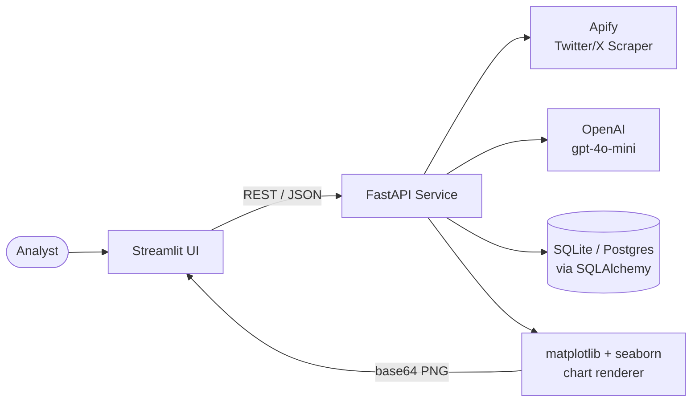

<div align="center">

# OSINT-Guard

**Turn a public Twitter/X footprint into a quantified risk score.**

Scrape a handle's public activity, let an LLM reason over it, and get back a risk
score, evidence-backed inferences, a pattern-of-life summary, and phishing
simulations you can use for security-awareness training — all visualized in a
live analytics dashboard.

[](https://www.python.org/)
[](https://fastapi.tiangolo.com/)
[](https://streamlit.io/)
[](https://www.sqlalchemy.org/)
[](https://platform.openai.com/)

</div>

---

## Overview

Security teams and OSINT analysts routinely need to answer one question about a
target account: *how much can an attacker infer about this person from what they've
already made public?* OSINT-Guard automates that assessment end-to-end — collect,
analyze, score, and visualize — for a single handle or an entire dataset at once.

> **Intended use:** authorized security research, red-team reconnaissance
> exercises, and phishing-awareness training. Only scan accounts you're authorized
> to assess, and treat generated phishing examples as internal training material,
> never for actual delivery.

## Key Features

- 🔍 **Live target scan** — pull a handle's public tweets on demand and score it
  in real time.
- 📥 **Bulk ingestion** — drop in a CSV/JSON export and score hundreds of accounts
  in one pass, grouped and deduplicated automatically.
- 🧠 **LLM-driven risk analysis** — an executive risk score, evidence-cited PII
  inferences, pattern-of-life reconstruction, and ready-to-use phishing
  simulations, generated from structured prompts.
- 📊 **Cross-account analytics** — eight auto-generated charts covering risk
  distribution, engagement, tweet volume, and category breakdowns.
- 💾 **Persistent, queryable history** — every scan is stored, cached, and
  searchable, so repeat lookups are instant.
- ⚡ **Two independent services** — the API and the UI run as separate processes
  and can be deployed, scaled, or swapped independently.

## Architecture



The frontend never talks to Apify, OpenAI, or the database directly — every
external call is proxied through the FastAPI service, which is the single source
of truth for stored profiles and the only component holding API credentials.

## Tech Stack

| Layer | Technology | Role |
| --- | --- | --- |
| UI | **Streamlit** | Interactive dashboard — scan, upload, analytics, and profile browser |
| API | **FastAPI** + **Uvicorn** | Async REST API, request validation, routing |
| Validation & config | **Pydantic v2**, `pydantic-settings` | Typed request models, `.env`-driven settings |
| Persistence | **SQLAlchemy 2.0** | ORM over SQLite (default) or any SQL database via `DATABASE_URL` |
| AI reasoning | **OpenAI API** (`gpt-4o-mini`) | Structured, JSON-mode prompts for risk scoring and inference |
| Data collection | **Apify** client | Managed Twitter/X scraping actor |
| Analytics | **pandas**, **matplotlib**, **seaborn** | Server-side chart generation, rendered to base64 PNG |

## Project Structure

```text
osint-guard/
├── backend/                       FastAPI service
│   ├── app/
│   │   ├── main.py                App factory, CORS, startup table creation
│   │   ├── config.py              Settings loaded from .env
│   │   ├── database.py            SQLAlchemy engine / session / declarative base
│   │   ├── models.py              TwitterProfile ORM model
│   │   ├── schemas.py             Pydantic request models
│   │   ├── routes.py              All /api/* endpoints
│   │   └── services/
│   │       ├── apify_collect.py   Apify actor runs → normalized tweets
│   │       ├── openai_insights.py 5 chained OpenAI calls → structured risk bundle
│   │       ├── stats.py           Deterministic engagement metrics (no AI)
│   │       └── analytics.py       Seaborn/matplotlib charts → base64 PNG
│   ├── requirements.txt
│   └── .env.example
│
└── frontend/                      Streamlit UI
    ├── streamlit_app.py           Target Scan · Bulk Ingestion · Analytics · Database
    └── requirements.txt
```

## Getting Started

### Prerequisites

- Python 3.11+
- An [Apify](https://apify.com/) API token (for live scans)
- An [OpenAI](https://platform.openai.com/) API key (for risk analysis)

### 1. Backend

```bash
cd backend
pip install -r requirements.txt
cp .env.example .env            # fill in APIFY_API_TOKEN and OPENAI_API_KEY
uvicorn app.main:app --reload   # http://127.0.0.1:8000
```

Database tables are created automatically on first run — there's no migration
step. Interactive API docs are served at `/docs` (Swagger) and `/redoc`.

### 2. Frontend

```bash
cd frontend
pip install -r requirements.txt
streamlit run streamlit_app.py  # http://localhost:8501
```

Point the dashboard at a different API host from the sidebar, or set
`OSINT_API_BASE` before launching.

> Without `APIFY_API_TOKEN`, live scans return `503`. Without `OPENAI_API_KEY`,
> risk analysis returns `503`. Everything else — dataset preview, stored-profile
> browsing, CSV export — works with no keys configured.

## Environment Variables

Configured in `backend/.env` (see `backend/.env.example`):

| Variable | Default | Description |
| --- | --- | --- |
| `DEBUG` | `true` | Enables permissive CORS for local dev; set `false` in production |
| `CORS_ALLOWED_ORIGINS` | `["http://localhost:8501", ...]` | Browser origins allowed to call the API when `DEBUG=false` |
| `DATABASE_URL` | SQLite file in `backend/` | Any SQLAlchemy-compatible connection string (Postgres, MySQL, etc.) |
| `APIFY_API_TOKEN` | *(empty)* | Required for live scraping |
| `APIFY_ACTOR_TWITTER` | `dy7gIgPRMhrOrfW0f` | Apify actor ID used for Twitter/X collection |
| `OPENAI_API_KEY` | *(empty)* | Required for AI risk analysis |
| `OPENAI_MODEL` | `gpt-4o-mini` | Chat Completions model used for all analysis prompts |
| `OPENAI_REQUEST_TIMEOUT` | `30` | Per-request timeout, in seconds |
| `AI_CACHE_TTL_HOURS` | `24` | How long a generated risk bundle is served from cache before re-analysis |

## API Reference

| Method | Endpoint | Description |
| --- | --- | --- |
| `GET` | `/api/health/` | Liveness probe |
| `POST` | `/api/collect/` | Scrape a handle's public tweets via Apify |
| `POST` | `/api/insights/` | Run the AI risk bundle (cached per user for `AI_CACHE_TTL_HOURS`) |
| `POST` | `/api/upload-bulk/` | Ingest a CSV/JSON export and score every user in it |
| `GET` | `/api/analytics/` | Render all 8 charts across stored profiles |
| `GET` | `/api/check-db/` | Fetch the 50 most recently scanned profiles |
| `GET` | `/api/profile/{username}/` | Fetch one stored profile |
| `GET` | `/api/usernames/` | List every stored handle |
| `GET / POST / DELETE` | `/api/clear-db/` | Wipe all stored profiles |

Full request/response schemas: `http://127.0.0.1:8000/docs`

## Usage

The dashboard is organized into four tabs:

1. **Target Scan** — look up a handle; serves from the database if already
   analyzed, otherwise scrapes and analyzes it live.
2. **Bulk Ingestion** — upload a CSV/JSON export, preview it, then ingest and
   score every unique user in one batch.
3. **Analytics** — generate all 8 cross-account charts on demand.
4. **Database** — browse, inspect, export (CSV), or clear stored profiles.

## Roadmap

- [ ] Containerization (Dockerfile + docker-compose for both services)
- [ ] Authentication / role-based access for multi-analyst deployments
- [ ] CI pipeline (lint, type-check, test on push)
- [ ] Background job queue for large bulk-ingestion runs
- [ ] Multi-platform support (currently Twitter/X only)

## Contributing

Issues and pull requests are welcome. For substantial changes, please open an
issue first to discuss what you'd like to change.

## License

No license has been specified yet — all rights reserved by default. Add a
`LICENSE` file (MIT, Apache-2.0, etc.) if you intend this project to be reused or
distributed.
